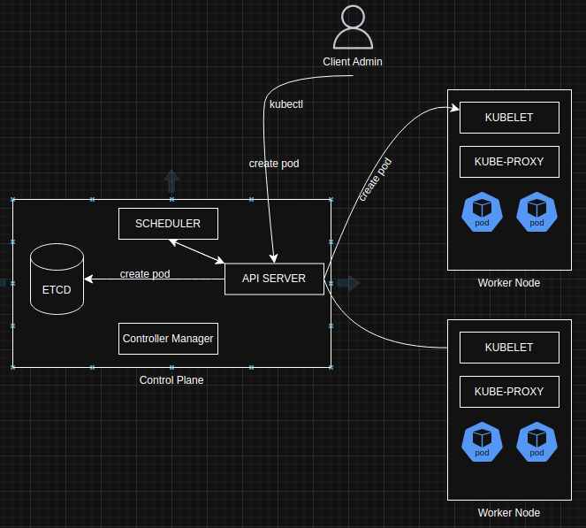

# Day05

## Task 5/40

1. **Task Details**
- Document your learnings from the video
    - Video mô tả chính về 2 các thành phần cơ bản trong Kubenetes là Control Plane (Master Node) và Worker Node
        - Các thành phần và chức năng của chúng trong Control Plane đã được viết ở phần bên dưới.
        - Các thành phần của Worker Node:
            - 1 Worker Node tương đương 1 Virtual Machine
            - Worker Node là nơi khởi tạo và chạy các Resources trong Kubenetes
            - Kubelet:
                - là nơi nhận + xử lý các yêu cầu từ Kube Api Server
            - Kube-Proxy:
                - tạo ra 1 lớp network trong Node đó, giúp các Pod có IP, có thể giao tiếp với nhau
- Create the Kubernetes Architecture diagram using the tool of your choice. You can use [eraser.io](http://eraser.io/), [draw.io](http://draw.io/), excalidraw, or anything else.
    - 
    
    
    
- Create a diagram of the end-to-end flow depicting what happens when you run a Kubectl command.
    - Hình bên trên là 1 end-to-end flow đơn giản khi người dùng muốn tạo 1 Pod
        1. Admin gửi cấu hình Pod bằng `kubectl` tới Kube Api Server
        2. Kube Api Server xác thực Admin danh tính và quyền hạn của Admin đó (người này có được cho phép không? / người này có quyền tạo Pod không?
        3. Sau khi xác thực về quyền, Kube Api Server ghi dữ liệu về Pod và ETCD
        4. SCHEDULER luôn watch Kube Api Server khi nào tạo Pod. SCHEDULER sẽ tìm Node phù hợp và gửi thông tin cho Kube Api Server
        5. Các KUBELET watch Kube Api Server, nhận thấy Node của mình cần thêm Pod → sẽ gọi container runtime để pull và tạo Pod theo cấu hình
        6. Quá trình hoàn tất. Kube Api Server nhận response của KUBELET. Kube Api Server response về cho User.
- Write the function of each control plane component in the most straightforward possible language.
    1. Control Plane:
        - quản lý toàn bộ trạng thái của Cluster
        - nhận yêu cầu từ kubectl
        - lên lịch tạo container
        - tự động phục hồi
        - đảm bảo trạng thái thực tế khớp với mong muốn
    2. Các Components của Control Plane:
        1. Kube API Server:
            - nhận mọi request từ worker node
            - nhận mọi request từ các component khác trong Control Plane
            - nhận mọi request từ kubectl
            - tiến hành xác thực, ủy quyền, validate YAML
        2. ETCD:
            - là cơ sở dữ liệu, lưu toàn bộ trạng thái Cluster (Pod, Service, ConfigMap …)
            - có dạng Key-Value
        3. Kube Scheduler:
            - lên lịch cho Pod
            - xác định xem Node nào phù hợp để chạy Pod (dựa trên: resources, affinity, taint/toleration, node selector…)
        4. Kube Controller Manager
            - quản lý các loại controller khác nhau: node controller, namespace controller, deployment controller
            - đảm bảo các controller hoạt động và healthy
            - đảm bảo các resource: Pod, deployment, … hoạt động như cấu hình

## Note