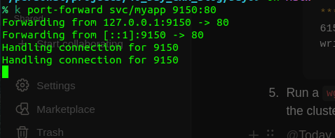

# Day09

## Task 9/40

In this exercise, you will create a Deployment and expose a container port for its Pods. You will demonstrate the differences between the service types ClusterIP and NodePort.

> [!NOTE]
If you do not already have a Kubernetes cluster, you can create a local Kubernetes cluster by following Day06 Video
Also, do the node binding at the cluster level if you are using KIND. The Day9 video has the details on how to do that.
> 

### Task details

1. Create a Service named `myapp` of type `ClusterIP` that exposes port 80 and maps to the target port 80.
    
    November 13, 2025 
    
    ```bnf
    apiVersion: v1
    kind: Service
    metadata:
      name: myapp
      labels:
        env: demo
    spec:
      selector:
        env: demo
      ports:
      - port: 80
        targetPort: 80
    ```
    
2. Create a Deployment named `myapp` that creates 1 replica running the image `nginx:1.23.4-alpine`. Expose the container port 80.
    
    November 13, 2025 
    
    ```bnf
    apiVersion: apps/v1
    kind: Deployment
    metadata:
      name: myapp
      labels:
        env: demo
    spec:
      replicas: 1
      selector:
        matchLabels:
          env: demo
      template:
        metadata:
          labels:
            env: demo
        spec:
    		  containers:
    		  - name: nginx
    		    image: nginx:1.23.4-alpine
    		    ports:
    		    - containerPort: 80
    ```
    
3. Scale the Deployment to 2 replicas.
    
    `kubectl scale deploy/myapp --replicas=2`
    
4. Create a temporary Pod using the image `busybox` and run a `wget` command against the IP of the service.
    
    `wget -O- 10.96.24.142:80`
    
    ```bnf
    Connecting to 10.96.24.142:80 (10.96.24.142:80)
    writing to stdout
    <!DOCTYPE html>
    <html>
    <head>
    <title>Welcome to nginx!</title>
    <style>
    html { color-scheme: light dark; }
    body { width: 35em; margin: 0 auto;
    font-family: Tahoma, Verdana, Arial, sans-serif; }
    </style>
    </head>
    <body>
    <h1>Welcome to nginx!</h1>
    <p>If you see this page, the nginx web server is successfully installed and
    working. Further configuration is required.</p>
    
    <p>For online documentation and support please refer to
    <a href="http://nginx.org/">nginx.org</a>.<br/>
    Commercial support is available at
    <a href="http://nginx.com/">nginx.com</a>.</p>
    
    <p><em>Thank you for using nginx.</em></p>
    </body>
    </html>
    -                    100% |***************************************************************************************************************************************************************|   615  0:00:00 ETA
    written to stdout
    ```
    
5. Run a `wget` command against the service outside the cluster.
    
    November 13, 2025 
    
    - Just using ClusterIP Service, we cannot connect to the application run in K8s.
    - We can run this command to forward request into ClusterIP Service
        - `k port-forward svc/myapp 9150:80`
            
            
            
        - go to  `localhost:9150` to get results
6. Change the service type so the Pods can be reached outside the cluster.
7. Run a `wget` command against the service outside the cluster.
8. Discuss: Can you expose the Pods as a service without a deployment?
    - có thể expose 1 Pod ra ngoài bằng Service, và truy cập tới Pod đó bằng cách sử dụng Port-forwarrd.
    - nhưng nếu Pod bị chết thì Service đó sẽ trống rỗng do không match selector
    - → nên sử dụng Deployment
9. Discuss: Under what condition would you use the service types `LoadBalancer,` `node port,` `clusterIP,` and `external`?
    - `LoadBalancer`
        - khi deploy trên cloud
        - muốn tự động provision một public load balancer
    - `node port`
        - khi muốn truy cập service từ bên ngoài cluster
        - dùng cho các trường hợp: lab, test
    - `clusterIP`
        - khi muốn các Pod trong Cluster giao tiếp với nhau (bên trong cluster)
    - `external`
        - sử dụng để map 1 service tới 1 external DNS name
10. **Share your learnings**: Document your key takeaways and insights in a blog post and social media update

## Note