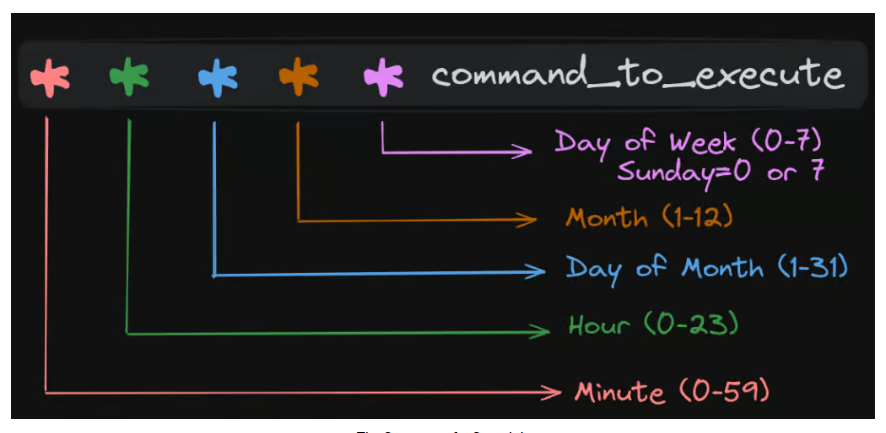

# Day12

## Task 12/40

In this exercise, you will explore daemonset, cronjob and job in kubernetes

> [!NOTE]
If you do not already have a Kubernetes cluster, you can create a local Kubernetes cluster by following Day06 Video
Also, could you do the port binding at the cluster level if you are using KIND? The Day9 video has the details on how to do that.
> 

### Task details

- Create a Daemonset as per the demo shown in the video.
    - ds.yaml
        
        ```bnf
        apiVersion: apps/v1
        kind: DaemonSet
        metadata:
          name: myds
          labels:
            env: demo
        spec:
          selector:
            matchLabels:
              env: demo
          template:
            metadata:
        		  labels:
        		    env: demo
            spec:
              containers:
              - name: my-container
                image: nginx
                ports:
                - containerPort: 80
                
        ```
        
- Undertand the cron syntax and create a cronjob object in kubernetes that prints "40daysofkubernetes" after every 5 minutes and use busybox image
    - cj.yaml
        
        ```bnf
        apiVersion: batch/v1
        kind: CronJob
        metadata:
          name: 40daysofkubernetes
        spec:
          scheduler: "*/5 * * * *"
          jobTemplate:
            spec:
              template:
                spec:
                  containers:
        		      - name: hello
        		        image: busybox
        		        command:
        			      - /bin/sh
        		        - -c
        		        - echo "40daysofkubernetes"
                
        ```
        

## Note

1. DaemonSet
    - đảm bảo số Pod luôn bằng số Node
    - nếu Node bị xóa thì Pod bị xóa theo
    - nếu Pod bị xóa thì sẽ tự động được tạo laij
    - một số usecase: mornitoring-agent, logging-agent …
2. Cronjob
    - scheduler trong cronjob cho là config cho biết khi nào sẽ chạy job đó.
        
        
        
    - ví dụ:
        - lên lịch để job chạy vào mọi thứ 7: 
        `* * * * 6`
        - schedule chạy vào mọi 23h thứ 7: 
        `* 23 * * 6`
        - schedule chạy vào mọi 23h30 thứ 7: 
        `30 23 * * 6`
        - schedule cứ 5 phút chạy 1 lần: 
        `*/5 * * * *`
3. Note nhỏ
    - để show DS ở mọi namespace thì dùng thêm flag `-A
    k get ds -A`
