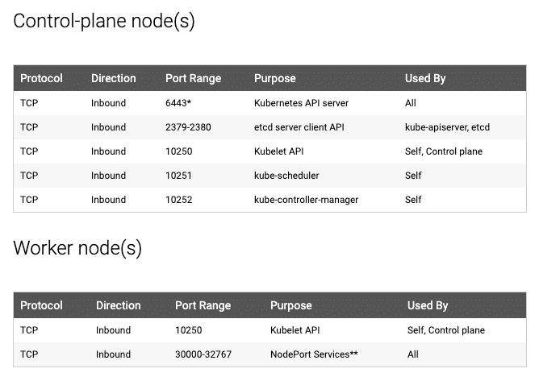

# Day27: Setup a Multi Node Kubernetes Cluster Using Kubeadm

## Task 27/40 January 5, 2026

In this exercise,You will setup a multi node Kubernetes cluster on virtual machines using kubeadm

### Task details

1. Install a multi-node Kubernetes cluster 1.29 on Virtual machines using kubeadm
2. It should have 1 master and 2 worker node
3. Also, install add-ons such as Kubelet, kubectl , kubeadm and Calico
4. All the nodes should be in ready status after the installation

## Note January 7, 2026 to January 9, 2026

REFERENCE: [https://devopscube.com/setup-kubernetes-cluster-kubeadm/#kubeadm-port-requirements](https://devopscube.com/setup-kubernetes-cluster-kubeadm/#kubeadm-port-requirements)

### I. **What is Kubeadm?**

1. **Defination**
    - Kubeadm is a tool to set up a minimum viable Kubernetes cluster
    - Play around with the cluster components or test utilities
    - Create a production-like cluster locally on a workstation for development and testing purposes.
2. **Kubeadm Setup Prerequisites**
    - **Master node** should have a minimum of **2 vCPU and 2GB RAM**
    - For the **Worker nodes**, a minimum of 1vCPU and 2 GB RAM is recommended.
    - **10.X.X.X/X** network range with static IPs for master and worker nodes
    - **192.x.x.x** series as the pod network range that will be used by the Calico network plugin
3. **Kubeadm Port Requirements**
    
    
    
    Additionally, Calico, requires specific UDP ports for inter-node and pod communication. So enable all UDP traffic between the cluster nodes.
    

### II. **Kubernetes Cluster Setup Using Kubeadm**

```bash
PS1="master_node@\$(hostname -I | awk '{print \$1}') \$ "
```

```bash
PS1="worker_node@\$(hostname -I | awk '{print \$1}') \$ "
```

**Step 1: Enable iptables Bridged Traffic on all the Nodes**

```bash
cat <<EOF | sudo tee /etc/modules-load.d/k8s.conf
overlay
br_netfilter
EOF

sudo modprobe overlay
sudo modprobe br_netfilter

# sysctl params required by setup, params persist across reboots
cat <<EOF | sudo tee /etc/sysctl.d/k8s.conf
net.bridge.bridge-nf-call-iptables  = 1
net.bridge.bridge-nf-call-ip6tables = 1
net.ipv4.ip_forward                 = 1
EOF

# Apply sysctl params without reboot
sudo sysctl --system
```

**Step 2: Disable swap on all the Nodes**

```bash
sudo swapoff -a
(crontab -l 2>/dev/null; echo "@reboot /sbin/swapoff -a") | crontab - || true
```

**Step 3: Install containerd Runtime On All The Nodes**

**docker-containerd (containerd)**

`containerd` is another system daemon service than is responsible for downloading the docker images and running them as a container. It exposes its API to receive instructions from the `dockerd` service

```bash
# Kubernetes Variable Declaration
CONTAINERD_VERSION="2.2.0"
RUNC_VERSION="1.3.3"

# Apply sysctl params without reboot
sudo sysctl --system

sudo apt-get update -y
sudo apt-get install -y apt-transport-https ca-certificates curl gpg

# Install containerd Runtime
sudo apt-get update -y
sudo apt-get install -y software-properties-common curl apt-transport-https ca-certificates

# Download and install containerd
curl -LO https://github.com/containerd/containerd/releases/download/v${CONTAINERD_VERSION}/containerd-${CONTAINERD_VERSION}-linux-amd64.tar.gz
sudo tar Cxzvf /usr/local containerd-${CONTAINERD_VERSION}-linux-amd64.tar.gz
rm containerd-${CONTAINERD_VERSION}-linux-amd64.tar.gz

# Download and install runc
curl -LO https://github.com/opencontainers/runc/releases/download/v${RUNC_VERSION}/runc.amd64
sudo install -m 755 runc.amd64 /usr/local/sbin/runc
rm runc.amd64

# Configure containerd
sudo mkdir -p /etc/containerd
containerd config default | sudo tee /etc/containerd/config.toml

# Enable SystemdCgroup in containerd config
sudo sed -i 's/SystemdCgroup = false/SystemdCgroup = true/' /etc/containerd/config.toml

# Create containerd systemd service
cat <<EOF | sudo tee /etc/systemd/system/containerd.service
[Unit]
Description=containerd container runtime
Documentation=https://containerd.io
After=network.target local-fs.target

[Service]
ExecStartPre=-/sbin/modprobe overlay
ExecStart=/usr/local/bin/containerd
Type=notify
Delegate=yes
KillMode=process
Restart=always
RestartSec=5
LimitNPROC=infinity
LimitCORE=infinity
LimitNOFILE=infinity
TasksMax=infinity
OOMScoreAdjust=-999

[Install]
WantedBy=multi-user.target
EOF

sudo systemctl daemon-reload
sudo systemctl enable containerd --now
sudo systemctl start containerd.service

sudo systemctl enable kubelet
sudo systemctl start kubelet
crictl ps
```

echo "Containerd runtime installed successfully"

**Step 4: Install & Configure Crictl to use Containerd**

```bash
# Install crictl
export CRICTL_VERSION="v1.34.0"

curl -LO https://github.com/kubernetes-sigs/cri-tools/releases/download/${CRICTL_VERSION}/crictl-${CRICTL_VERSION}-linux-amd64.tar.gz
sudo tar zxvf crictl-${CRICTL_VERSION}-linux-amd64.tar.gz -C /usr/local/bin
rm -f crictl-${CRICTL_VERSION}-linux-amd64.tar.gz

# Configure crictl to use containerd
cat <<EOF | sudo tee /etc/crictl.yaml
runtime-endpoint: unix:///run/containerd/containerd.sock
image-endpoint: unix:///run/containerd/containerd.sock
timeout: 10
debug: false
EOF

echo "crictl installed and configured successfully"
```

**Step 5: Install Kubeadm & Kubelet & Kubectl on all Nodes**

```bash
KUBERNETES_VERSION=v1.34

sudo curl -fsSL https://pkgs.k8s.io/core:/stable:/$KUBERNETES_VERSION/deb/Release.key |
   sudo gpg --dearmor -o /etc/apt/keyrings/kubernetes-apt-keyring.gpg

echo "deb [signed-by=/etc/apt/keyrings/kubernetes-apt-keyring.gpg] https://pkgs.k8s.io/core:/stable:/$KUBERNETES_VERSION/deb/ /" |
    tee /etc/apt/sources.list.d/kubernetes.list
```

`sudo apt-get update -y`
command to show KUBERNETES_INSTALL_VERSION:`apt-cache madison kubeadm | tac`

```bash
KUBERNETES_INSTALL_VERSION="1.34.2-1.1"

sudo apt-get install -y kubelet="$KUBERNETES_INSTALL_VERSION" kubectl="$KUBERNETES_INSTALL_VERSION" kubeadm="$KUBERNETES_INSTALL_VERSION"
```

```bash
sudo apt-mark hold kubelet kubeadm kubectl
```

```bash
sudo apt-get install -y jq

local_ip="$(ip --json addr show eth0 | jq -r '.[0].addr_info[] | select(.family == "inet") | .local')"

cat > /etc/default/kubelet << EOF

KUBELET_EXTRA_ARGS=--node-ip=$local_ip

EOF
```

Command to check version:

`kubeadm version -o short`

`kubectl version --client`

**Step 6: Create the Kubeadm Config**
`vi kubeadm.config`

```yaml
apiVersion: kubeadm.k8s.io/v1beta4
kind: InitConfiguration
localAPIEndpoint:
  advertiseAddress: "192.168.238.121"
  bindPort: 6443
nodeRegistration:
  name: "controlplane"

---
apiVersion: kubeadm.k8s.io/v1beta4
kind: ClusterConfiguration
kubernetesVersion: "v1.34.2"
controlPlaneEndpoint: "192.168.238.121:6443"
apiServer:
  extraArgs:
    - name: "enable-admission-plugins"
      value: "NodeRestriction"
    - name: "audit-log-path"
      value: "/var/log/kubernetes/audit.log"
controllerManager:
  extraArgs:
    - name: "node-cidr-mask-size"
      value: "24"
scheduler:
  extraArgs:
    - name: "leader-elect"
      value: "true"
networking:
  podSubnet: "10.244.0.0/16"
  serviceSubnet: "10.96.0.0/12"
  dnsDomain: "cluster.local"

---
apiVersion: kubelet.config.k8s.io/v1beta1
kind: KubeletConfiguration
cgroupDriver: "systemd"
syncFrequency: "1m"

---
apiVersion: kubeproxy.config.k8s.io/v1alpha1
kind: KubeProxyConfiguration
mode: "ipvs"
conntrack:
  maxPerCore: 32768
  min: 131072
  tcpCloseWaitTimeout: "1h"
  tcpEstablishedTimeout: "24h"
```

**Step 7: Initialize Kubeadm On Controlplane Node**

```bash
sudo kubeadm init --config=kubeadm.config
```

verify the kubeconfig by executing the following kubectl command: `kubectl get po -n kube-system`

verify all the cluster component health statuses using the following command: `kubectl get --raw='/readyz?verbose'`

can get the cluster info using the following command: `kubectl cluster-info`

**Step 8: Join Worker Nodes To Kubernetes Control Plane**

Tại Worker Node, lặp lại các bước từ **Step 1** đến **Step 5**

Command to Join worker node to Cluster

```bash
kubeadm join 192.168.238.121:6443 --token uoq8s5.kt9kw2vbvk0gvara --discovery-token-ca-cert-hash sha256:d1d7bbf8c65f9f5422ad8c9e98cffee6f6cd2ceac3b0028d36e2670e90546475 --v=5 
```

Command to grant Role for WorkerNode

```bash
kubectl label node woker-node-1  node-role.kubernetes.io/worker=worker
```

Delete Node:

```bash
kubectl drain <node_name> --ignore-daemonsets --force
kubectl delete node <node_name>
```

**Step 9: Install Calico Network Plugin for Pod Networking**

**Step 1: Install the Tigera Operator and Custom Resources**

```bash
kubectl create -f https://raw.githubusercontent.com/projectcalico/calico/v3.29.1/manifests/tigera-operator.yaml
```

> Tigera
> 
> 
> The above command installs the Tigera operator in your Kubernetes cluster.
> 
> The Tigera operator is responsible for managing the installation and lifecycle of Calico, which is a CNI (Container Network Interface) plugin used for pod networking and network policies.
> 
> - It creates necessary Kubernetes resources, such as Custom Resource Definitions (CRDs), deployments, and service accounts related to Calico.

**Step 2: Download the Calico Custom Resource**

```bash
curl https://raw.githubusercontent.com/projectcalico/calico/v3.29.1/manifests/custom-resources.yaml -O
```

**Step 3: Get the cluster CIDR range**
`kubectl -n kube-system get pod -l component=kube-controller-manager -o yaml | grep -i cluster-cidr` 

**Step 4: Customize custom-resources.yaml**

Do config trong kubeadm.config có networking:

```yaml
networking:
  podSubnet: "10.244.0.0/16"
```

Nên cần edit lại subnet network trong config của Calico:

```yaml
apiVersion: operator.tigera.io/v1
kind: Installation
metadata:
  name: default
spec:
  # Configures Calico networking.
  calicoNetwork:
    ipPools:
    - name: default-ipv4-ippool
      blockSize: 26
      cidr: 10.244.0.0/16
      encapsulation: VXLANCrossSubnet
      natOutgoing: Enabled
      nodeSelector: all()
```

**Step 5: Deploy the custom resource**

Apply changes:  `kubectl apply -f custom-resources.yaml` 

It may take a **few minutes** for all the pods to reach the running state.
`kubectl get po -A` 

Sau khi cài xong, trạng thái các Node sẽ là Ready: `kubectl get no` 

**Step 6: Setup Kubernetes Metrics Server**

Show node metrics: `kubectl top nodes` 

Install **Kubernetes Metrics Server:** `kubectl apply -f https://raw.githubusercontent.com/techiescamp/cka-certification-guide/refs/heads/main/lab-setup/manifests/metrics-server/metrics-server.yaml` 


**Step 9: Deploy A Sample Nginx Application**

```bash
cat <<EOF | kubectl apply -f -
apiVersion: apps/v1
kind: Deployment
metadata:
  name: nginx-deployment
spec:
  selector:
    matchLabels:
      app: nginx
  replicas: 2 
  template:
    metadata:
      labels:
        app: nginx
    spec:
      containers:
      - name: nginx
        image: nginx:latest
        ports:
        - containerPort: 80      
EOF
```

Expose deployment: `k expose deploy nginx-deployment --type=NodePort --port=80 --target-port=80` 


**Step 10: Add Kubeadm Config to Workstation**

Nếu thích connect Kubeadm cluster bằng kubectl từ workstation, bạn có thể merge admin.config vào kubeconfig file đang tồn tại

- **Step 1:** copy file /etc/kubernetes/admin.conf từ Master Node ra máy Local thành ~/.kube/kubeadm-config.yaml
- **Step 2:** trên máy local, backup config hiện tại: `cp ~/.kube/config ~/.kube/config.bak`
- **Step 3:** Merge the default config with kubeadm-config.yaml and export it to KUBECONFIG variable: `export KUBECONFIG=~/.kube/config:~/.kube/kubeadm-config.yaml`
- **Step 4:** Merger the configs to a file: `kubectl config view --flatten > ~/.kube/merged_config.yaml`
- **Step 5:** Replace the old config with the new config: `mv ~/.kube/merged_config.yaml ~/.kube/config`
- **Step 6:** List all the contexts:`kubectl config get-contexts -o name`
- **Step 7:** Set the current context to the kubeadm cluster: `kubectl config use-context <cluster-name-here>`

**Step 11: Validate the Cluster:** `kubectl cluster-info` 

Next, we will test the CoreDNS DNS resolution.

To check if CoreDNS can resolve internal Kubernetes services, lets deploy a dnsutils pod.

```bash
kubectl apply  -f https://raw.githubusercontent.com/techiescamp/cka-certification-guide/refs/heads/main/lab-setup/manifests/utilities/dnsutils.yaml

kubectl get pods dnsutils
```


To check if the cluster can resolve external domains, execute:

```bash
master_node@192.168.238.121 $ kubectl exec -i -t dnsutils -- nslookup kubernetes.default

Server:         10.96.0.10
Address:        10.96.0.10#53

Name:   kubernetes.default.svc.cluster.local
Address: 10.96.0.1

master_node@192.168.238.121 $ kubectl exec -i -t dnsutils -- nslookup google.com
Server:         10.96.0.10
Address:        10.96.0.10#53

Non-authoritative answer:
Name:   google.com
Address: 142.250.71.142
Name:   google.com
Address: 2404:6800:4005:81a::200e
```

### III. Trouble Shooting

1. User thông thường không gọi được `critctl`:
    
    ```bash
    sudo groupadd containerd
    sudo chgrp containerd /run/containerd/containerd.sock
    sudo chmod 660 /run/containerd/containerd.sock
    sudo usermod -aG containerd quangtm
    newgrp containerd
    ```
    
2. Lỗi join worker node: kiểm tra lại phần swap đã tắt chưa
3. Có thể gặp lỗi khi install the official [metrics serve](https://github.com/kubernetes-sigs/metrics-server?ref=devopscube.com)r repo. 

